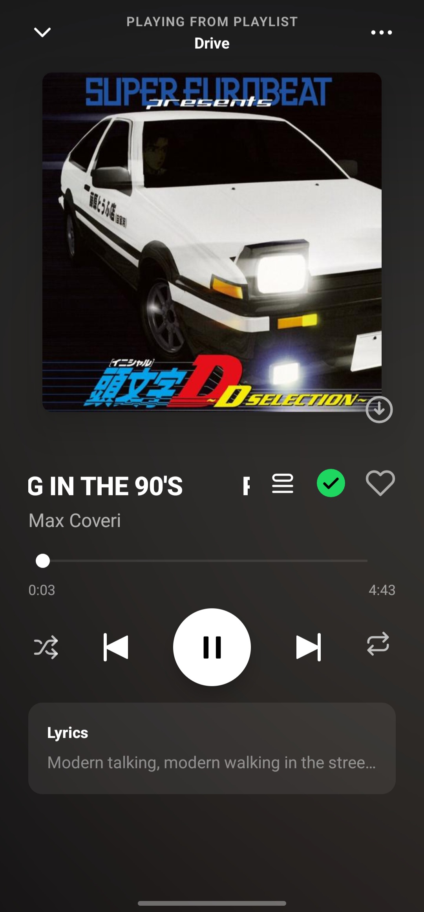
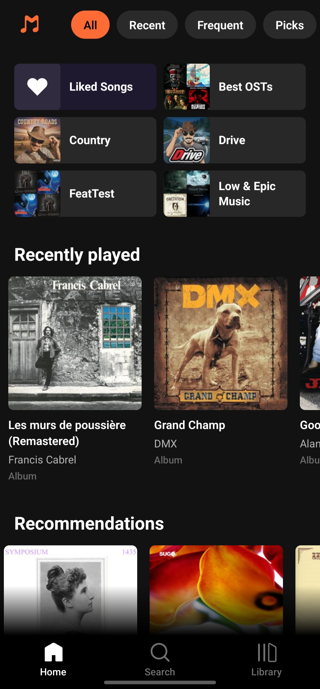
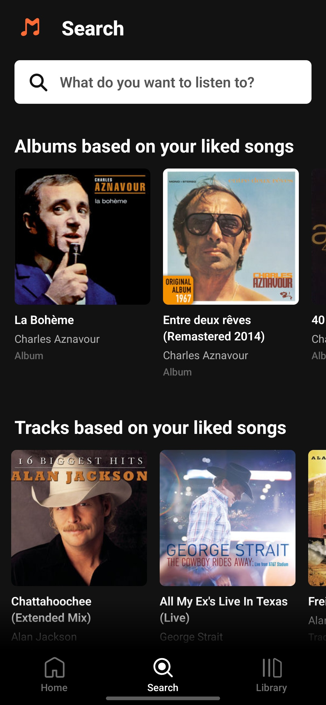
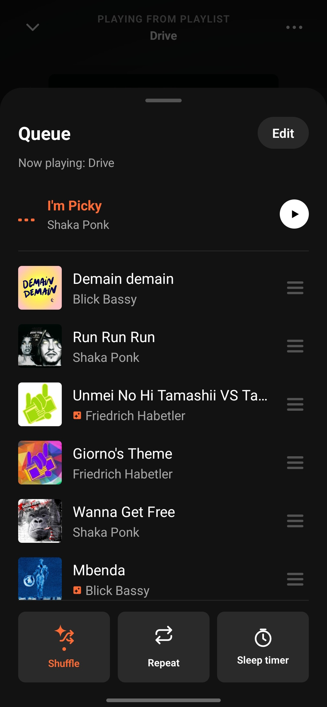
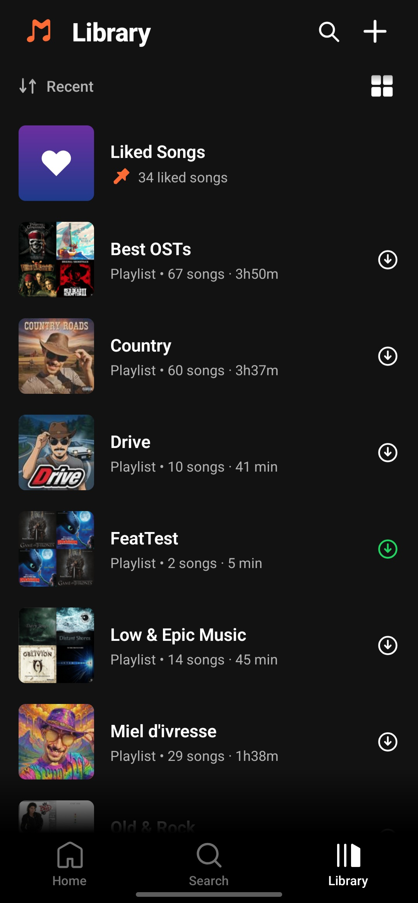
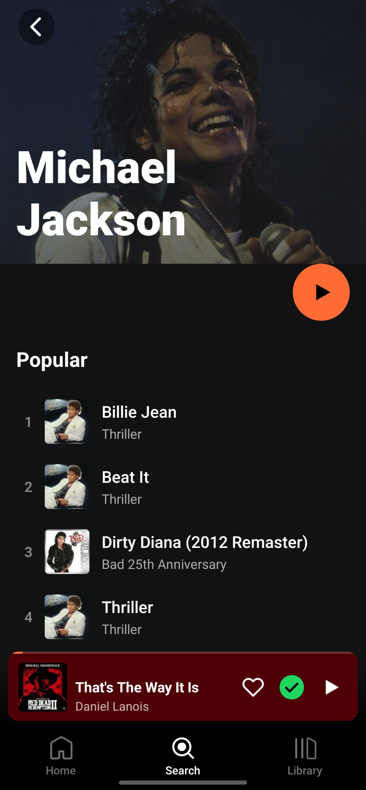
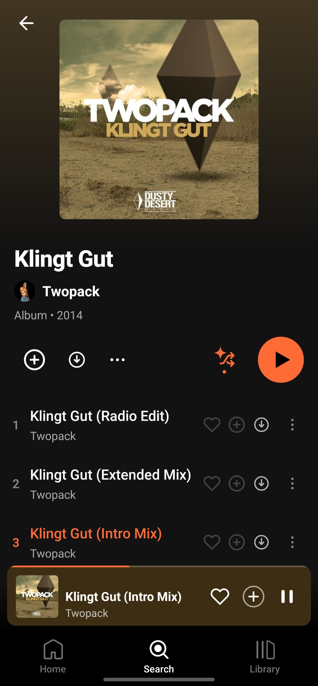
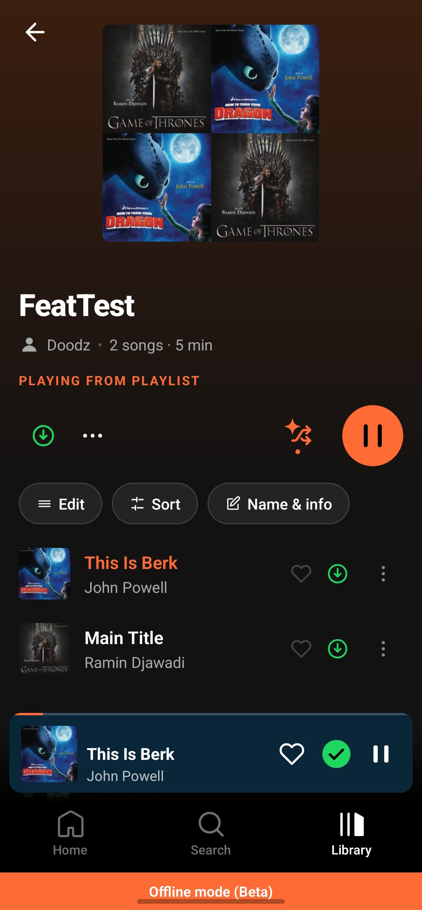
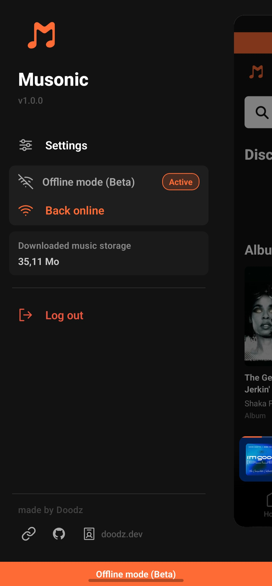
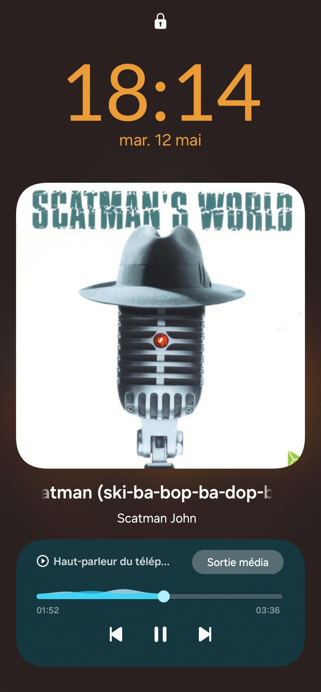

# Musonic

[](https://creativecommons.org/licenses/by-nc/4.0/)
[](https://reactnative.dev)
[](https://github.com/DoodzProg/Musonic/releases)

A Spotify-inspired mobile client for Navidrome and Subsonic-compatible servers, built with React Native (New Architecture). Own your music. Own your experience.

---

## Table of Contents

- [Features](#features)
- [Screenshots](#screenshots)
- [Getting Started](#getting-started)
  - [Prerequisites](#prerequisites)
  - [Installation — Android](#installation--android)
  - [Installation — iOS](#installation--ios-macos-only)
- [Server Setup](#server-setup)
  - [Navidrome (standard)](#navidrome-standard)
  - [OctoFiesta (optional)](#octofiesta-optional)
- [CI/CD](#cicd)
- [Building a Signed APK](#building-a-signed-apk)
- [Project Structure](#project-structure)
- [Architecture Notes](#architecture-notes)
- [Known Limitations](#known-limitations)
- [License](#license)

---

## Features

### Playback
- **Full-screen player** — ambient halo background extracted from album art, animated cover, waveform / classic scrubber toggle
- **Mini player** — persistent bottom bar with swipe-to-skip gesture
- **Queue management** — drag-and-drop reordering, remove, move-to-top
- **Crossfade** — configurable fade between tracks
- **Repeat** — off / all / one
- **Shuffle** — standard shuffle + Shuffle Magic (genre-aware third state, powered by Deezer recommendations)
- **Autoplay** — automatic queue extension with Deezer + Navidrome similar tracks when queue ends
- **Synced lyrics** — real-time line-by-line highlight; Navidrome embedded lyrics with LRCLIB as fallback
- **Lock screen & media notification** — full playback controls from Android lock screen and notification shade

### Library & Discovery
- **Library** — albums, playlists, and Liked Songs with sort options, pin support, pull-to-refresh
- **Home screen** — quick-access grid, filter pills: All, Recent, Frequent, Recommendations, Discover
- **Artist detail** — artist photo via Deezer public API (no key required), top songs, full discography, "Similar artists" album cards
- **Album detail** — dominant-color gradient header, full track listing, star/unstar
- **Liked Songs** — star/unstar from anywhere with optimistic UI and offline retry queue
- **Search** — full-text songs, artists, and albums; Discover tab with Deezer-powered recommendations across 6 sections

### Playlists
- Create, rename, edit cover, delete
- Drag-and-drop track reordering with inline search
- Recommendation footer — Deezer tracks based on the playlist's top artists
- Add/remove tracks from any playlist via contextual option sheet

### Offline Mode & Downloads
- **Offline mode (Beta)** — manual toggle or auto-detected via server ping; Library and Playlist Detail load from local cache when offline
- **Track downloads** — download individual tracks or entire playlists to device storage for offline playback (Navidrome-indexed tracks only)
- **Download management** — delete individual downloads or full playlist batches; total storage usage displayed in the side drawer
- **Shuffle intercept** — Shuffle Magic automatically falls back to standard shuffle when offline

### Infrastructure
- **MMKV persistence** — credentials, preferences, download index, and playlist cache survive app restarts at native speed
- **Connectivity monitor** — periodic background ping with automatic online/offline state propagation
- **i18n** — French and English UI, switchable from Settings
- **React Native New Architecture** — Fabric + JSI; no legacy bridge

---

## Screenshots

| Player (Waves) | Player (Classic) | Synced Lyrics |
|---|---|---|
|  |  |  |

| Home | Search · Discover | Queue · Shuffle Magic |
|---|---|---|
|  |  |  |

| Library | Artist Detail | Album Detail |
|---|---|---|
|  |  |  |

| Playlist (Downloaded) | Offline Sidebar | Lock Screen |
|---|---|---|
|  |  |  |

---

## Getting Started

### Prerequisites

| Requirement | Details |
|---|---|
| **Navidrome or Subsonic server** | Any recent version; OctoFiesta is optional — see [Server Setup](#server-setup) |
| **Android device** | Android 8.0+ (API 26+) |
| **iOS device** | iOS 15+ — sideload only via AltStore or Sideloadly |
| **Node.js** | ≥ 22.11.0 (see `.nvmrc`) |
| **JDK** | 21 (Temurin recommended) |
| **Android SDK** | 34 or 36 |
| **NDK** | 27.1 |

> You do **not** need a cloud account, API key, or internet access beyond your own server. Musonic uses the Deezer public API for artist images and recommendations — no registration required.

### Installation — Android

```bash
# 1. Clone the repository
git clone https://github.com/DoodzProg/Musonic.git
cd Musonic

# 2. Switch to the correct Node version
nvm use          # reads .nvmrc (22.11.0)

# 3. Install JS dependencies
npm install

# 4. Connect your device and launch
adb reverse tcp:8081 tcp:8081
npm start -- --reset-cache   # Terminal 1 — Metro bundler
npm run android               # Terminal 2
```

### Installation — iOS (macOS only)

```bash
bundle install
cd ios && bundle exec pod install && cd ..
npm run ios
```

---

## Server Setup

### Navidrome (standard)

Open Musonic, tap **Settings → Server**, and enter:

| Field | Value |
|---|---|
| Server URL | `https://your-navidrome-domain.tld` |
| Username | your Navidrome username |
| Password | your Navidrome password |

No additional configuration required. Musonic uses standard Subsonic API endpoints.

### OctoFiesta (optional)

[OctoFiesta](https://github.com/DoodzProg/octo-fiesta) is a Subsonic-compatible middleware layer that extends Navidrome with external catalog streaming. When Musonic is connected to an OctoFiesta instance, the Deezer-powered recommendation engine goes beyond surfacing discovery results — tracks, albums, and artists from the external catalog can be played directly alongside your personal library, with seamless ID routing handled transparently on both ends.

Configuration is identical to a standard Navidrome setup:

| Field | Value |
|---|---|
| Server URL | `https://your-octofiesta-domain.tld` |
| Username | your Navidrome username |
| Password | your Navidrome password |

Musonic handles `ext-deezer:` prefixed IDs automatically. Cover art, artist images, and stream URLs all resolve without any client-side configuration.

---

## CI/CD

Musonic uses GitHub Actions for automated builds and releases:

| Workflow | Trigger | Output |
|---|---|---|
| `android-release.yml` | Push tag `v*` or manual dispatch | Signed release APK |
| `ios-release.yml` | Push tag `v*` or manual dispatch | Unsigned IPA (AltStore / Sideloadly) |
| `ci.yml` | PR to `main` | TypeScript type check |

**Required GitHub Secrets** (Settings → Secrets → Actions):

| Secret | Value |
|---|---|
| `KEYSTORE_BASE64` | Base64-encoded `musonic-release.keystore` |
| `KEYSTORE_PASSWORD` | Keystore password |
| `KEY_ALIAS` | `musonic` |
| `KEY_PASSWORD` | Same as `KEYSTORE_PASSWORD` (PKCS12) |

To trigger a release:

```bash
git tag v1.0.0 && git push origin v1.0.0
```

Both workflows fire automatically and attach the APK and IPA as assets on the GitHub Release.

---

## Building a Signed APK

```bash
# Ensure android/keystore.properties references your keystore (git-ignored)
cd android
./gradlew assembleRelease
# Output: android/app/build/outputs/apk/release/app-release.apk
```

> `musonic-release.keystore` and `android/keystore.properties` are git-ignored. Keep a secure offline backup of both files — they cannot be recovered if lost.

---

## Project Structure

```
src/
├── api/
│   ├── client.ts          Subsonic fetch client, URL helpers
│   ├── types.ts           TypeScript type definitions
│   ├── deezer.ts          Deezer public API — recommendations, artist images (no key)
│   ├── apiKeys.example.ts API key template (no keys currently required)
│   └── endpoints/
│       ├── library.ts     getRecentAlbums, getStarred, star/unstar, similar songs
│       ├── playlists.ts   CRUD playlist operations
│       └── search.ts      search() + Deezer async image enrichment
├── components/            Shared UI — player, sheets, icons, cards
├── hooks/                 useSetupPlayer, useImageColor
├── i18n/                  fr.ts (source of truth) + en.ts + index.ts hook
├── navigation/            RootNavigator, TabNavigator, stacks, type definitions
├── screens/               Home, Search, Library, AlbumDetail, ArtistDetail,
│                          PlaylistDetail, LikedSongs, Settings, ServerSetup
├── services/              PlaybackService (headless), playerActions, connectivityService
├── store/                 Zustand stores: player, settings, search history,
│                          playlist cache, download store, playlist membership cache
├── theme/                 Design tokens, dark theme object
└── utils/                 colorUtils (hex blending, ID-to-colour mapping)
```

---

## Architecture Notes

### Audio Engine
React Native Track Player 4.1.2, patched for New Architecture (37 `scope.launch` fixes). `playerStore` is the UI source of truth; RNTP is the audio source of truth. `AudioPlayer.tsx` bridges RNTP events → store. The `isMagic` flag is preserved across queue operations via RNTP track metadata to ensure Shuffle Magic tracks render correctly after queue mutations.

### HTTP Client
All API calls use native `fetch` with `AbortController` for cancellation and `URLSearchParams` for query string construction. No third-party HTTP client.

### Offline & Downloads
`connectivityService` pings the server periodically and sets `isOfflineMode` in `settingsStore`. `playlistCacheStore` holds playlist metadata and song lists for offline access. `downloadStore` manages per-track file downloads with a semaphore (max 3 concurrent), MMKV persistence, and `getTotalSizeBytes()` for storage reporting. Only Navidrome-indexed tracks are downloadable; Deezer-sourced tracks (`ext-` prefix) are silently skipped.

### Drawer Navigation
`@react-navigation/drawer` is not used — it caused a `WorkletsError` with react-native-reanimated v4. A custom `DrawerContainer` (React context + `Animated`) replaces it. `react-native-reanimated/plugin` must remain **last** in `babel.config.js`.

### Playlist Track Indicator
Tracks highlight only when playing from the current playlist context (checked via `currentPlaylistId`). Playing from album, search, or Liked Songs correctly clears the context. Duplicate songs in a playlist are disambiguated by RNTP queue index, not by song ID.

### New Architecture
`newArchEnabled=true` in `gradle.properties` is required. `UIManager.setLayoutAnimationEnabledExperimental` must not be called — it is incompatible with Fabric.

---

## Known Limitations

| Issue | Status |
|---|---|
| iOS background audio cuts | `UIBackgroundModes: audio` missing from `Info.plist` — planned post-v1.0.0 |
| iOS Dynamic Island header | `GlobalHeader` lacks safe-area insets; header partially hidden on notched devices |
| iOS distribution | Unsigned IPA only — install via AltStore or Sideloadly; no App Store planned |
| FSP swipe gesture | Removed in v1.0.0 — Android `<Modal>` + RNGH incompatibility |

---

## License

This project is licensed under the [CC BY-NC 4.0](LICENSE) license.
Free to use and adapt for personal, non-commercial purposes. Commercial use is prohibited.
