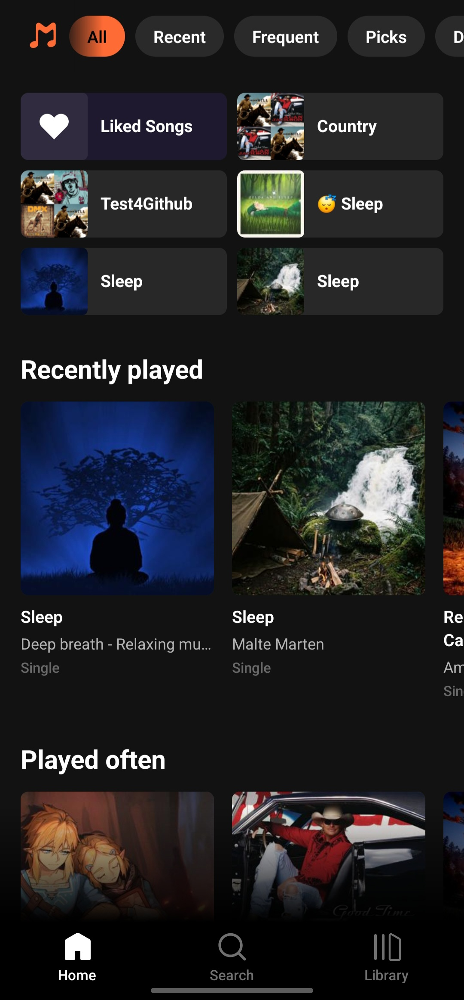
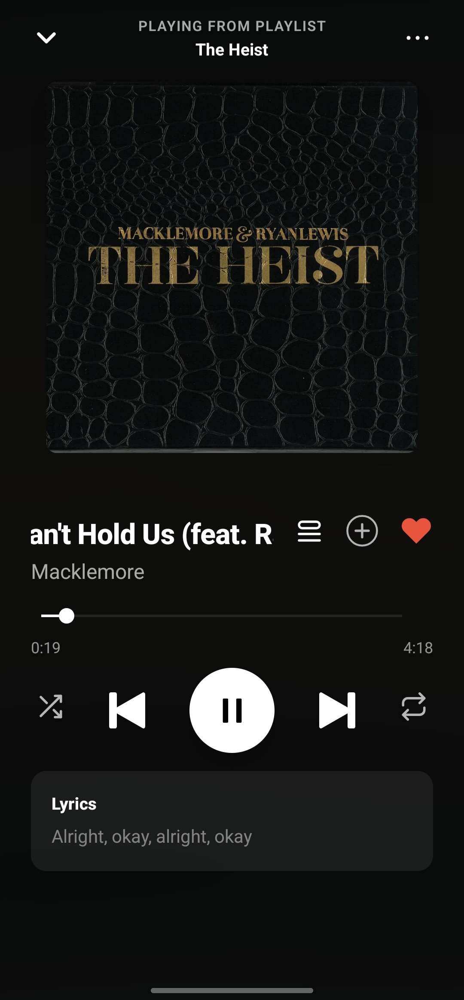
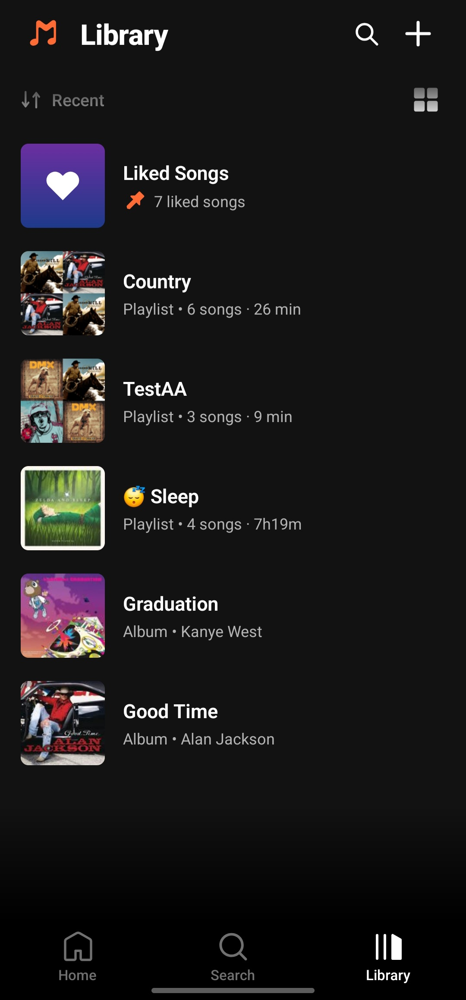
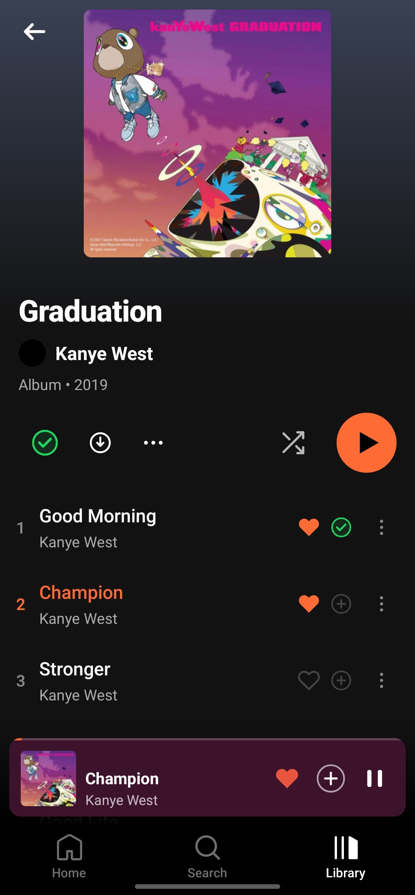
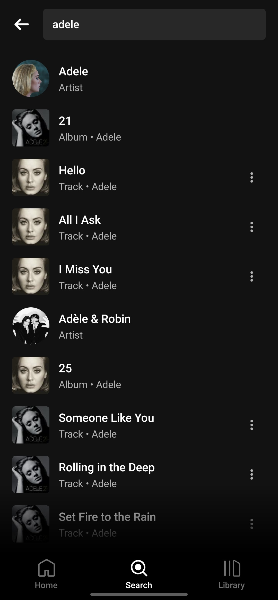
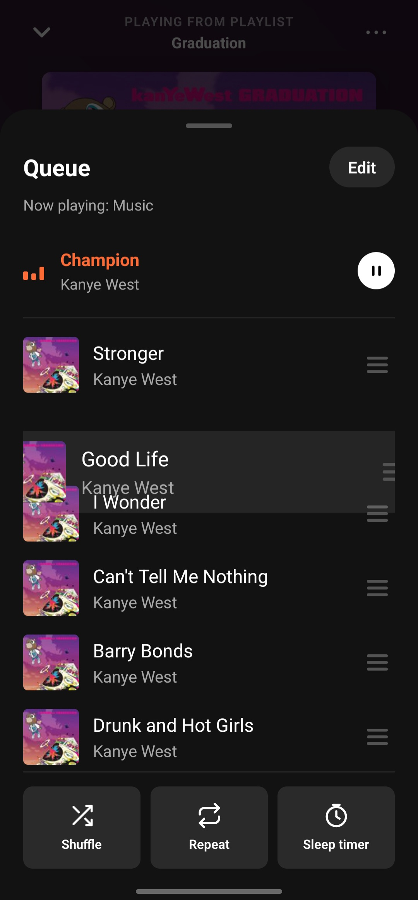
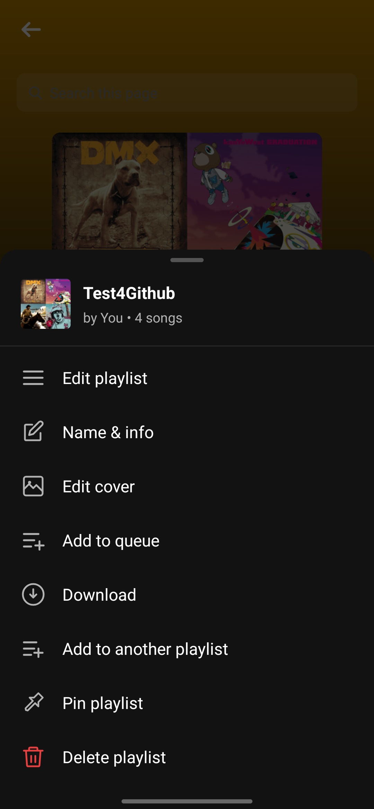
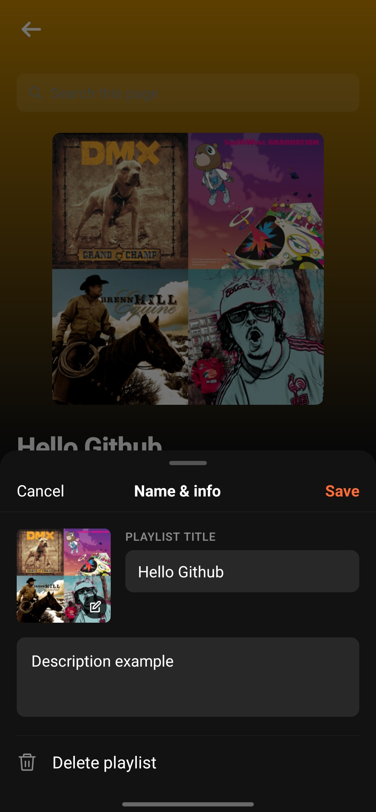
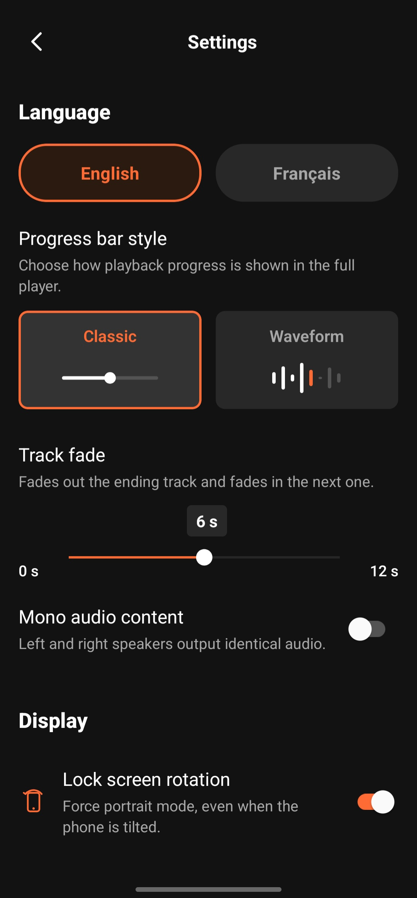
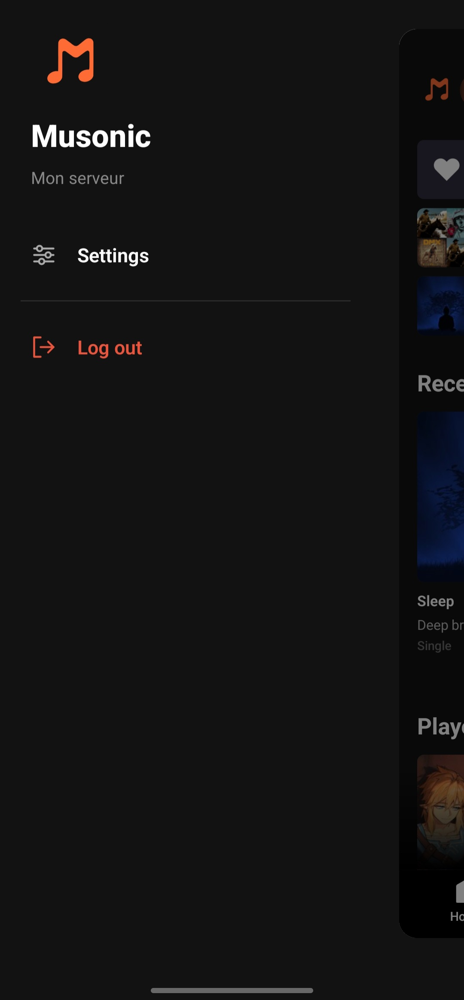

# Musonic

🌍 **English** | [Lire en Français](#français)

[](https://creativecommons.org/licenses/by-nc/4.0/)
[](https://reactnative.dev)
[](https://github.com/DoodzProg/Musonic/releases)

A modern, Spotify-inspired Subsonic/Navidrome client built with React Native (New Architecture).  
Designed for OctoFiesta + Navidrome but compatible with any Subsonic-compatible server.

---

## Features

- **Full-screen player** — ambient halo background, swipeable cover carousel, waveform scrubber
- **Mini player** — sticky bottom bar with swipe-to-skip gesture
- **Queue management** — drag-and-drop reordering, remove, move-to-top
- **Playlist management** — create, rename, edit cover, delete; drag-and-drop track reordering
- **Library** — albums and playlists with sort options, pin support, pull-to-refresh
- **Artist & Album detail** — cover art, top songs, discography, artist photo via Deezer (no API key)
- **Home screen** — quick-access grid, filter pills (Recent, Frequent, Recommendations, Discover)
- **Liked Songs** — star/unstar with optimistic UI and offline retry
- **Search** — songs, artists, albums; Deezer artist images enriched asynchronously
- **Offline resilience** — credentials and preferences persisted via MMKV
- **i18n ready** — French and English UI strings; language switchable in Settings

---

## Screenshots

| Home | Player (Classic) | Player (Waves) |
|------|-----------------|----------------|
|  |  |  |

| Library | Album Detail | Artist Detail |
|---------|-------------|---------------|
|  |  |  |

| Search | Queue | Lyrics |
|--------|-------|--------|
|  |  |  |

| Playlist Options | Playlist Edit | Settings | Sidebar |
|-----------------|---------------|----------|---------|
|  |  |  |  |

---

## Requirements

| Tool | Version |
|------|---------|
| Node.js | ≥ 22.11.0 (see `.nvmrc`) |
| React Native | 0.85 (New Architecture / Fabric enabled) |
| JDK | 21 (Temurin recommended) |
| Android SDK | 34 or 36 |
| NDK | 27.1 |
| Navidrome | any recent version (or OctoFiesta proxy) |

---

## Installation

```bash
# 1. Clone the repository
git clone https://github.com/DoodzProg/Musonic.git
cd Musonic

# 2. Use the correct Node version
nvm use          # reads .nvmrc

# 3. Install JS dependencies
npm install

# 4. Run on Android (device or emulator)
adb reverse tcp:8081 tcp:8081
npm start -- --reset-cache   # Terminal 1 — Metro bundler
npm run android               # Terminal 2
```

> No API keys required — Deezer public API is used for artist images without authentication.

### iOS (macOS only)

```bash
bundle install
cd ios && bundle exec pod install && cd ..
npm run ios
```

---

## Server Setup

### Standard Navidrome

Point Musonic at your Navidrome instance via **Settings → Server**:

```
Server URL : https://your-navidrome-domain.tld
Username   : your_navidrome_username
Password   : your_navidrome_password
```

No extra configuration required. All Subsonic API endpoints are used as-is.

### OctoFiesta (Navidrome + Deezer proxy)

[OctoFiesta](https://github.com/DoodzProg/octo-fiesta) is a Navidrome reverse-proxy that adds on-demand Deezer streaming via the Subsonic API. Configuration is identical:

```
Server URL : https://your-octofiesta-domain.tld
Username   : your_navidrome_username
Password   : your_navidrome_password
```

Musonic handles `ext-deezer:` prefixed IDs transparently — no client-side ID mangling needed. Cover art, artist images, and stream URLs all resolve correctly.

---

## CI/CD

Musonic uses GitHub Actions for automated builds:

| Workflow | Trigger | Output |
|----------|---------|--------|
| `android-release.yml` | Push tag `v*` or manual | Signed release APK |
| `ios-release.yml` | Push tag `v*` or manual | Unsigned IPA (sideload via AltStore/Sideloadly) |
| `ci.yml` | PR to `main` / push to `develop` | Lint + type check |

**Required GitHub Secrets** (Settings → Secrets → Actions):

| Secret | Value |
|--------|-------|
| `KEYSTORE_BASE64` | Base64-encoded `musonic-release.keystore` |
| `KEYSTORE_PASSWORD` | Keystore password |
| `KEY_ALIAS` | `musonic` |
| `KEY_PASSWORD` | Same as `KEYSTORE_PASSWORD` (PKCS12) |

---

## Build — Signed Android APK

```bash
# 1. Ensure keystore is configured
# android/keystore.properties must reference your keystore file (git-ignored)

# 2. Build release APK
cd android
./gradlew assembleRelease

# Output: android/app/build/outputs/apk/release/app-release.apk
```

> The keystore file (`android/app/musonic-release.keystore`) and `android/keystore.properties` are git-ignored. Keep a secure backup.

---

## Project Structure

```
src/
├── api/
│   ├── client.ts          Subsonic axios client, URL helpers
│   ├── types.ts           TypeScript type definitions
│   ├── deezer.ts          Deezer public API — artist image helper (no key required)
│   ├── apiKeys.example.ts API key template (no keys currently required)
│   └── endpoints/
│       ├── library.ts     getRecentAlbums, getStarred, star/unstar, similar songs
│       ├── playlists.ts   CRUD playlist operations
│       └── search.ts      search() + Deezer async image enrichment
├── components/            Shared UI (player, sheets, icons, cards…)
├── hooks/                 useSetupPlayer, useImageColor
├── i18n/                  fr.ts (source of truth) + en.ts + index.ts hook
├── navigation/            RootNavigator, TabNavigator, stacks, type definitions
├── screens/               Home, Search, Library, AlbumDetail, ArtistDetail,
│                          PlaylistDetail, LikedSongs, Settings, ServerSetup
├── services/              PlaybackService (headless), playerActions, connectivity
├── store/                 Zustand stores: player, settings, network, search history,
│                          playlist membership cache
├── theme/                 Design tokens, dark theme object
└── utils/                 colorUtils (hex blending, ID-to-colour mapping)
```

---

## Architecture Notes

### Audio Engine
React Native Track Player 4.1.2, patched for New Architecture (37 `scope.launch` fixes). `playerStore` is the UI source of truth; RNTP is the audio source of truth. `AudioPlayer.tsx` bridges RNTP events → store.

### Drawer Navigation
`@react-navigation/drawer` is **not used directly** — it caused a `WorkletsError` with react-native-reanimated v4. A custom `DrawerContainer` (React context + `Animated`) replaces it. `react-native-reanimated/plugin` must remain **last** in `babel.config.js`.

### Playlist Orange Indicator
Songs turn orange only when they are playing **in the context of the open playlist** (checked via `currentPlaylistId`). Playing from album/search/liked-songs correctly clears the playlist context. Duplicate songs in a playlist are disambiguated by **RNTP track index**, not by song ID.

### New Architecture
`newArchEnabled=true` is required in `gradle.properties`. `UIManager.setLayoutAnimationEnabledExperimental` must not be called (Fabric incompatible).

---

## License

This project is licensed under the [CC BY-NC 4.0](LICENSE) license.  
Free to use and adapt for personal, non-commercial purposes. Commercial use is prohibited.

---

---

# Français

🌍 [Read in English](#musonic) | **Français**

Client Subsonic/Navidrome moderne et minimaliste, inspiré de Spotify, développé avec React Native (New Architecture).  
Conçu pour OctoFiesta + Navidrome, mais compatible avec tout serveur compatible Subsonic.

---

## Fonctionnalités

- **Lecteur plein écran** — fond ambiant, carousel de pochettes, scrubber waveform
- **Mini-lecteur** — barre sticky avec geste swipe-to-skip
- **File d'attente** — réorganisation drag-and-drop, suppression, monter en tête
- **Gestion des playlists** — créer, renommer, modifier la pochette, supprimer ; réorganisation drag-and-drop
- **Bibliothèque** — albums et playlists avec tri, épinglage, pull-to-refresh
- **Détail Artiste & Album** — pochette, titres populaires, discographie, photo artiste via Deezer (sans clé API)
- **Accueil** — grille d'accès rapide, filtres (Récent, Fréquent, Recommandations, À découvrir)
- **Titres likés** — aimer/dé-liker avec UI optimiste et retry hors-ligne
- **Recherche** — titres, artistes, albums ; images artiste Deezer enrichies de façon asynchrone
- **Résilience hors-ligne** — identifiants et préférences persistés via MMKV
- **i18n** — français et anglais ; langue changeante dans les Paramètres

---

## Prérequis

| Outil | Version |
|-------|---------|
| Node.js | ≥ 22.11.0 (voir `.nvmrc`) |
| React Native | 0.85 (New Architecture / Fabric activée) |
| JDK | 21 (Temurin recommandé) |
| Android SDK | 34 ou 36 |
| NDK | 27.1 |
| Navidrome | toute version récente (ou proxy OctoFiesta) |

---

## Installation

```bash
# 1. Cloner le dépôt
git clone https://github.com/DoodzProg/Musonic.git
cd Musonic

# 2. Utiliser la bonne version de Node
nvm use

# 3. Installer les dépendances JS
npm install

# 4. Lancer sur Android (appareil ou émulateur)
adb reverse tcp:8081 tcp:8081
npm start -- --reset-cache   # Terminal 1 — Metro bundler
npm run android               # Terminal 2
```

> Aucune clé API requise — l'API publique Deezer est utilisée pour les images artiste sans authentification.

### iOS (macOS uniquement)

```bash
bundle install
cd ios && bundle exec pod install && cd ..
npm run ios
```

---

## Configuration serveur

### Navidrome standard

Configurer Musonic via **Paramètres → Serveur** :

```
URL du serveur : https://votre-domaine-navidrome.tld
Nom d'utilisateur : votre_utilisateur_navidrome
Mot de passe : votre_mot_de_passe_navidrome
```

### OctoFiesta (proxy Navidrome + Deezer)

[OctoFiesta](https://github.com/DoodzProg/octo-fiesta) est un reverse-proxy Navidrome qui ajoute le streaming Deezer à la demande via l'API Subsonic. La configuration est identique :

```
URL du serveur : https://votre-domaine-octofiesta.tld
Nom d'utilisateur : votre_utilisateur_navidrome
Mot de passe : votre_mot_de_passe_navidrome
```

Les IDs préfixés `ext-deezer:` sont gérés de façon transparente — aucune manipulation côté client.

---

## CI/CD

Musonic utilise GitHub Actions pour les builds automatisés :

| Workflow | Déclencheur | Résultat |
|----------|-------------|----------|
| `android-release.yml` | Push tag `v*` ou manuel | APK release signé |
| `ios-release.yml` | Push tag `v*` ou manuel | IPA non signé (sideload via AltStore/Sideloadly) |
| `ci.yml` | PR vers `main` / push sur `develop` | Lint + vérification de types |

---

## Build — APK Android signé

```bash
# 1. Vérifier que le keystore est configuré
# android/keystore.properties doit référencer votre fichier keystore (ignoré par git)

# 2. Construire l'APK release
cd android
./gradlew assembleRelease

# Résultat : android/app/build/outputs/apk/release/app-release.apk
```

> Le fichier keystore (`android/app/musonic-release.keystore`) et `android/keystore.properties` sont ignorés par git. Faites-en une sauvegarde sécurisée.

---

## Structure du projet

```
src/
├── api/
│   ├── client.ts          Client axios Subsonic, helpers URL
│   ├── types.ts           Définitions de types TypeScript
│   ├── deezer.ts          API publique Deezer — helper images artiste (sans clé)
│   ├── apiKeys.example.ts Modèle de clés API (aucune clé requise actuellement)
│   └── endpoints/
│       ├── library.ts     getRecentAlbums, getStarred, star/unstar, titres similaires
│       ├── playlists.ts   Opérations CRUD playlists
│       └── search.ts      search() + enrichissement images Deezer asynchrone
├── components/            UI partagée (lecteur, sheets, icônes, cartes…)
├── hooks/                 useSetupPlayer, useImageColor
├── i18n/                  fr.ts (source de vérité) + en.ts + hook index.ts
├── navigation/            RootNavigator, TabNavigator, stacks, types
├── screens/               Home, Search, Library, AlbumDetail, ArtistDetail,
│                          PlaylistDetail, LikedSongs, Settings, ServerSetup
├── services/              PlaybackService (headless), playerActions, connectivité
├── store/                 Stores Zustand : lecteur, paramètres, réseau,
│                          historique de recherche, cache d'appartenance playlist
├── theme/                 Design tokens, objet dark theme
└── utils/                 colorUtils (mélange hex, mapping ID → couleur)
```

---

## Licence

Ce projet est distribué sous licence [CC BY-NC 4.0](LICENSE).  
Libre d'utilisation et d'adaptation à des fins personnelles et non commerciales. Tout usage commercial est interdit.
